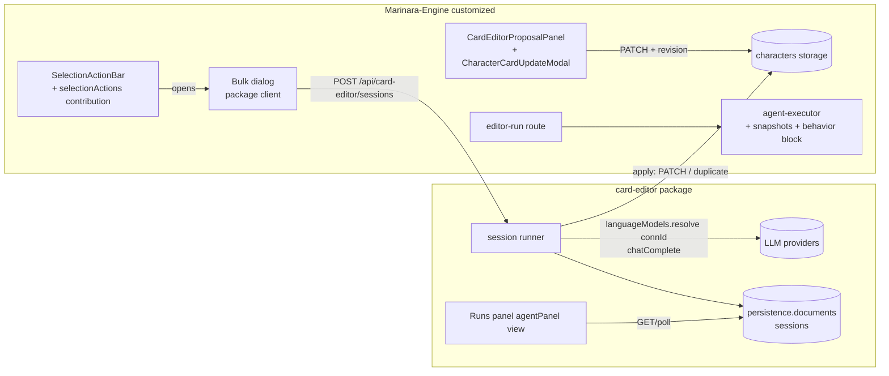

# ARCH — Card Editor bulk/behavior/apply architecture (Engine + Agents package)

Companions: SPEC 2026-10-04_17-45, DESIGN.md bible, SCOUT-REPORTs 2026-10-04_17-2x (evidence + file:line citations).

## 0. Split of ownership
- **Marinara-Engine (`customized`, engine-worker)**: staleness snapshots + apply UX (F1), editor-run behavior character (F2.1), two new package contributions — `selectionActions` (F3.1) and `agentPanel` (F5.1 mount), capabilityApi minor bump + engine version bump. No bulk logic engine-side.
- **Marinara-Agents `packages/card-editor` (agents-worker)**: graduation to feature package; bulk runner, session store, apply service, prompts/presets, all package UI (dialog, runs panel, verdict queue, edit-retry).



## 1. Engine deltas (E-tasks)

### E1 Snapshots + faithful context (`agent-executor.ts`, `generate.routes.ts`, `agents.routes.ts`)
- When building `<character_cards>` for card-edit agents, capture `fieldSnapshots: Record<characterId, Record<field, cardPromptText(raw)>>` (post comment-strip/trim; in-chat: post macro resolution since that is what the model sees) and attach to the `character_card_update` result payload (`result.data.fieldSnapshots`, additive; `CharacterCardUpdate` shared type extension).
- `generate.routes.ts:4290` macro loop: resolve onto copies for card-edit agent contexts (no in-place `charInfo` mutation).
- Client staleness: shared helper `isFieldStale(update, data, snapshot?)` in `character-card-fields.ts`: snapshot present → `cardPromptText(current) !== snapshot[field]`; else legacy `includes`. Used by both surfaces.

### E2 Apply UX (both client surfaces) — DESIGN §1
- Rows: single always-enabled Apply; stale → inline confirm strip ([Apply anyway]/[Skip]); whole-field replace `setCharacterCardFieldValue(newText)` → PATCH `{versionSource:"agent", versionReason:"Card Editor update"}`; remove `appendStaleCardReplacement` usage from the modal; [Apply selected] summary confirm when stale rows included. i18n keys under existing card-update namespaces.

### E3 editor-run behavior character
- `editorRunSchema` + `behaviorCharacterId?: string|null`; server loads that character, builds the block (below) and appends to the system prompt; panel picker (search-select over `useCharacters`-equivalent catalog, localStorage `cardEditor.behaviorCharacterId`).

### E4 `contributions.selectionActions`
- Manifest: `contributions: { selectionActions: { contexts: ["characters"] } }` (requires `ui` permission + client entrypoint; validated like agentDetail).
- `CharactersPanel` renders, inside `SelectionActionBar.extraAction`, a `CapabilityElement view="selection-action"` per contributing installed package; `capabilityProps`: `{ selectedCharacterIds: string[], selectionCount, onRequestClose }`; engine updates props on selection change (existing `marinara-capability-props` event). Package renders its own button; opening its dialog is package-internal (overlay within the element's DOM).

### E5 `contributions.agentPanel`
- Manifest: `contributions: { agentPanel: { agentIds: ["card-editor"] } }`; valid for ANY packaged agent (incl. execution `pipeline`) — unlike `agentDetail` (unchanged, feature/host only, replaces view).
- `AgentEditor` (agent detail for installed packages): when contribution present, renders `CapabilityElement view="agent-panel"` BELOW the existing settings; props: `{ agent, package, onClose? }`. This is the runs-panel mount (user: "additional panel below the pre-existing settings").

### E6 Version stamp
- capabilityApi minor bump (1.66 → 1.67) for the two contributions + snapshot/behavior fields; engine patch/minor version bump on `customized`; agents package `builtAgainst`/`engine.min` pinned to it (chai-workflow lane rule). Engine regression additions (below) + typecheck/build green.

## 2. Package architecture (`packages/card-editor`)

```
src/engine/packages/
├── client/src/features/card-editor/
│   ├── client-entry.tsx            (marinara-capability-card-editor; views: selection-action | agent-panel)
│   ├── api.ts                      (typed fetch to /api/card-editor/*)
│   ├── BulkDispatchDialog.tsx      (DESIGN §2 sections, estimates, per-target notes/style)
│   ├── RunsPanel.tsx               (sessions list + session detail item table; polling)
│   ├── VerdictQueue.tsx            (triage review: hunk previews, A/R keys, progress dots)
│   ├── EditRetryDialog.tsx         (failed prompt editor)
│   ├── BehaviorCharacterSelect.tsx (shared search-select)
│   └── locales/en.json             (cardEditor.* keys)
├── server/src/services/card-editor/
│   ├── server-entry.ts             (activate: routes + selfCheck; mark interrupted sessions)
│   ├── routes.ts                   (POST /sessions, GET /sessions, GET /sessions/:id,
│   │                                POST /sessions/:id/cancel, /items/:itemId/retry,
│   │                                /items/:itemId/edit-retry, /items/:itemId/verdict,
│   │                                DELETE /sessions/:id)
│   ├── session-store.ts            (persistence.documents CRUD, session schema, migration field)
│   ├── runner.ts                   (orchestration: queue, concurrency, batches, cancel, overflow split)
│   ├── llm.ts                      (languageModels.resolve(connectionId), call + retry + backoff,
│   │                                refusal detection, context-overflow classification)
│   ├── context.ts                  (card fetch, behavior block, lorebook context builder, XML assembly)
│   ├── prompts.ts                  (presets standard/strict/rebalance + custom; directive blocks)
│   ├── parse.ts                    (response → per-character updates; validation rules SPEC §4)
│   └── apply.ts                    (save modes: confirm queue / auto / duplicate; stale-at-apply; PATCH/duplicate)
└── shared/src/features/agents/card-editor/schema.ts  (Session, Item, Batch, Update, config types — single source)
```

Builder: `scripts/build-feature-packages.mjs` feature-table entry for `card-editor` (permissions `agent-runtime, chat-read, prompt-context, routes, storage, ui` — no `network`: LLM via capability host), `packageSourceRoot` = `src/engine`, contributions `selectionActions + agentPanel`, agents def keeps phase `post_processing` + existing prompt (single-run path unchanged apart from behavior block support); `promptTemplates[]` for the three presets. Locales metadata via sync-package-locales.

## 3. Data model (schema.ts — authoritative)

```ts
type SaveMode = "confirm" | "auto" | "duplicate";
type ItemStatus = "queued"|"running"|"succeeded"|"awaiting-review"|"applied"|"duplicated"|
  "needs-review"|"rejected"|"failed-provider"|"failed-refusal"|"failed-parse"|"canceled"|"interrupted";
interface BulkSessionConfig {
  mode: "individual"|"batched"; batchSize: number;            // 1..16, default 4
  connectionId: string|null;                                  // null = agent default
  presetId: "standard"|"strict"|"rebalance"|"custom"; customTemplate?: string;
  globalInstruction: string; behaviorCharacterId: string|null;
  globalLorebookIds: string[]; rebalance: boolean;
  providerRetries: number; refusalRetries: number; concurrency: number; // 2 / 3 / 1
  saveMode: SaveMode; duplicateSuffix: string;                // " (Edited)"
}
interface SessionItem {
  itemId: string; characterId: string; characterName: string;
  note?: string; behaviorOverride?: string|null;              // per-target style
  status: ItemStatus; snapshots: Record<field, string>;       // at dispatch (cardPromptText-equivalent)
  updates?: CardFieldUpdate[];                                // validated {field, oldText, newText, reason}
  failure?: { kind: "provider"|"refusal"|"parse"; message: string; rawOutput?: string;
              renderedPrompt?: { system: string; user: string }; attempts: number };
  resultCardId?: string;                                      // duplicate mode: new card id
  appliedAt?: string; batchId?: string;
}
interface BulkSession {
  id: string; schemaVersion: 1; createdAt: string; label: string;
  config: BulkSessionConfig; items: SessionItem[];
  batches: { id: string; itemIds: string[]; status: "pending"|"running"|"split"|"done"|"failed"; attempts: number }[];
  status: "active"|"completed"|"canceled"|"interrupted";
  stats: { total: number; done: number; failed: number };
}
```

State transitions: queued→running→succeeded→(confirm: awaiting-review→applied|rejected) | (auto: applied|needs-review) | (duplicate: duplicated) ; running→failed-*→(retry→running) ; any→canceled (cancel) / interrupted (restart).

## 4. Contracts

### Prompt assembly (identical semantics engine editor-run & package)
- Character block per card: XML-escaped fields (`cardPromptText` normalization; package re-implements the ~15-line normalize + escape — privateEngineImports must stay `[]`; contract test locks format).
- `<behavior_character>` block: `Name/Description/Personality/Backstory/Appearance` (+`System` if non-empty) + fixed instruction line (DESIGN §4).
- Lorebooks: selected books' enabled entries, stable order, per-entry cap 4 000 chars (marker `[…truncated]`), total cap 24 000 chars; `<lorebook name="…">` wrapper.
- Directives: global instruction → per-card `<user_note>` → rebalance block (SPEC F3.7 text) appended in that order after the base preset template.

### Batched call (mode=batched)
- Request: system = preset template (+ blocks); user = `<bulk_edit><character id="…" name="…">…fields…<user_note>…</user_note>[behavior block]</character>×N</bulk_edit>`; ids are opaque tokens also mapped in a legend to keep JSON keys exact.
- Response contract: strict JSON `{"<characterId>": {"updates":[…]}}`. Parse: JSONish-tolerant (strip fences); missing/invalid entries → individual re-run of those cards (marked, not failed).
- Overflow: classify context-length errors (provider message/code patterns: `context_length`, `maximum context`, `too many tokens`, HTTP 400 with those strings); on hit → split batch in half (⌈n/2⌉), re-enqueue both halves (recursion floor 1); batch status `split`, attempts logged. Non-overflow 400s are not retried as overflow.

### Retry policy (llm.ts)
- Provider errors (network, 429, 5xx, timeout): retry ≤ providerRetries, backoff 1s·2^n + jitter, AbortSignal-aware.
- Refusal: detector = no parseable updates AND (output < 400 chars OR refusal marker regex: "I can't", "I cannot", "as an AI", "I'm sorry", "I won't" — case-insensitive, word-bounded); retry ≤ refusalRetries with a terse reminder appended to the user message; exhaustion → failed-refusal retaining output + renderedPrompt.
- Invalid JSON: one strict-JSON reminder retry, then failed-parse.

### Package routes (all JSON, session-scoped, auth via engine privileged routes)
`POST /api/card-editor/sessions` {targets:[{characterId, note?, behaviorOverride?}], config} → session; `GET /sessions` (index), `GET /sessions/:id` (detail incl. updates); `POST /sessions/:id/cancel`; `POST /sessions/:id/items/:itemId/retry` (re-dispatch); `…/edit-retry` {system, user} (edited prompt dispatch); `…/verdict` {verdict:"approve"|"reject", force?:boolean, includeFields?}; `DELETE /sessions/:id`. Polling GET only; no SSE.

### Apply (apply.ts)
- Confirm mode: verdict approve → for included fields: stale check (`normalize(current) !== snapshot`) → fresh: PATCH; stale: honor `force` flag from the inline confirm, else return needs-review.
- Auto mode: on success immediately as confirm-with-force=false; stale → needs-review (never blind write).
- Duplicate: `POST /api/characters/:id/duplicate` (copy of CURRENT card), PATCH copy fields = newText, rename + suffix; record resultCardId.
- All PATCHes: `{versionSource:"agent", versionReason:"Card Editor bulk: <label>"}`.

## 5. Error & edge matrix (must-test)
| Case | Behavior |
|---|---|
| Card deleted mid-session | item failed-provider-independent → status needs-review w/ message "card missing"; apply skips |
| Duplicate name collision | engine duplicate handles uniqueness; suffix appended to current name |
| Concurrent session on same card | allowed; snapshot mismatch → needs-review path |
| Provider 401/403 | non-retryable → failed-provider immediately |
| Empty updates `[]` | item succeeded with no changes; confirm mode: auto-approved no-op |
| Batch response with unknown characterId keys | ignored + logged (validation SPEC §4) |
| Session with 200+ cards | UI paginates items (50/page); runner streams batches sequentially |
| Server restart mid-run | activate() marks active→interrupted; rerun re-dispatches unfinished items |
| package deactivated mid-session | aborts calls (host disposal), sessions remain readable |

## 6. Validation & proofs (per task, fresh runs)
- Engine: `pnpm -r typecheck && pnpm -r build` (or repo equivalents), `pnpm test scripts/regressions/agent-editor-run.regression.ts` style invocations + new `card-update-staleness.regression.ts` (SPEC AC1) + `agent-runtime.regression.ts` still green.
- Agents: SPEC AC6 command list; new `tests/card-editor-bulk.regression.mjs` (pure-function coverage: refusal detector, overflow split recursion, parse validation, session reducer) run via the repo's regression runner (`node tests/…`).
- Live user proof AC4 after engine image `netrve/marinara-engine:customized` rebuild+push (engine-worker, end of E6).

## 7. Sequencing
E1–E3 parallel-safe (disjoint engine files: E1 executor/routes+clients, E2 clients, E3 routes+panel); E4/E5+E6 after E1–E3 (schema+version stamp single commit). Package: A1 skeleton after E6 stamp known (can develop against engine checkout branch); A2 schema/api; A3 runner + A4 context/apply/llm parallel (disjoint files, schema.ts frozen first); A5 dialog + A6 panel/queue parallel; A7 prompts/locales/release last. Engine image + package release close the loop.
